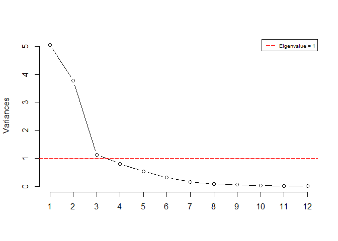
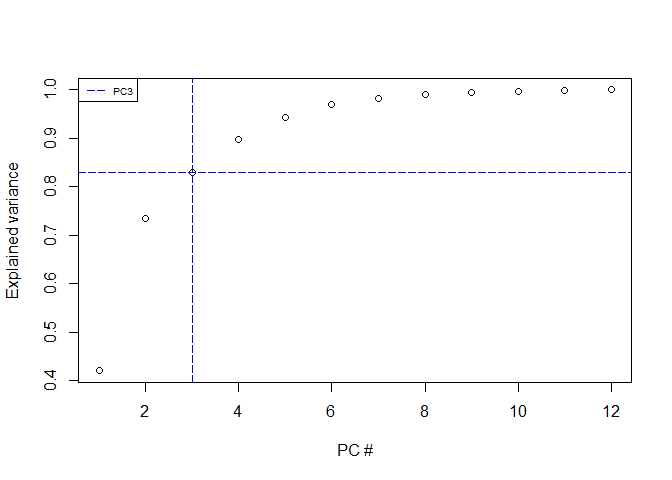
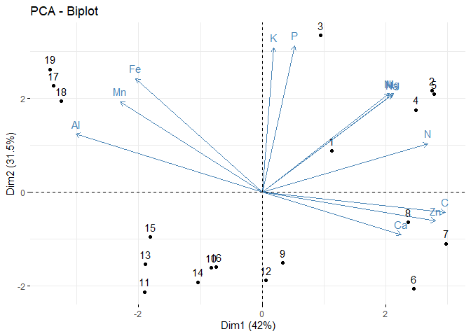
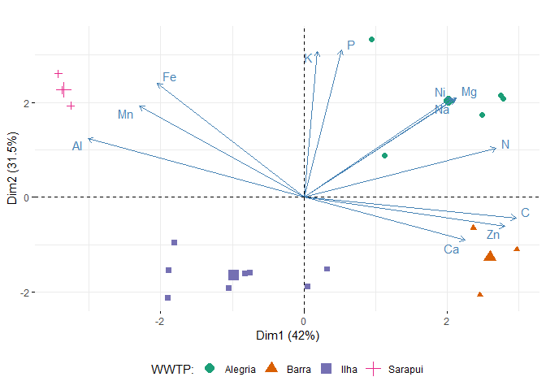
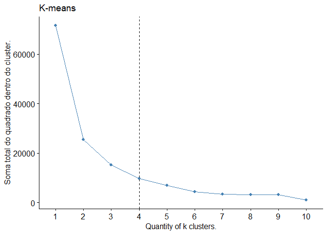
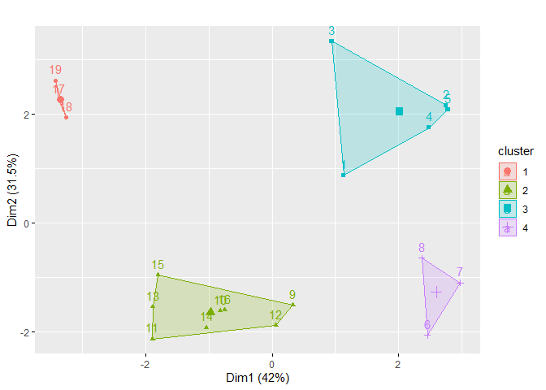
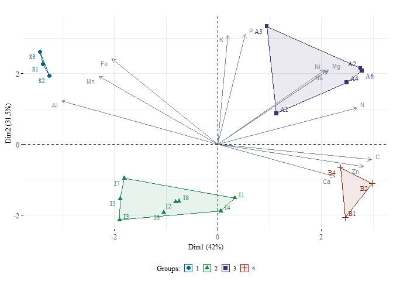
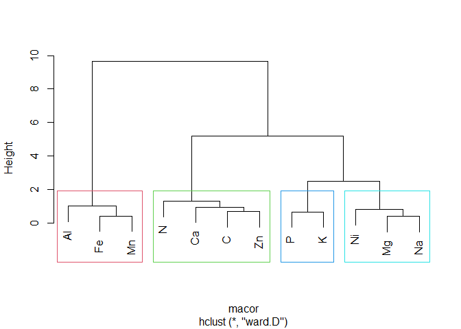
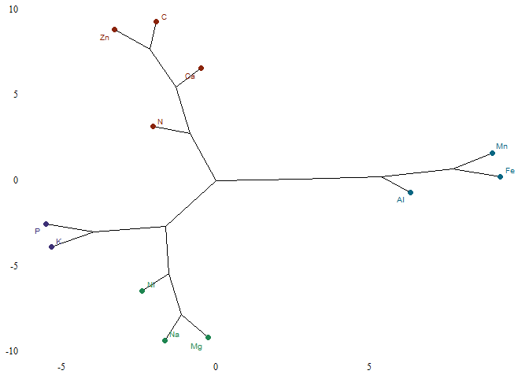

Sewage sludge analysis
================
Jorge Alonso
2023-08-07

### Loading…

``` r
# Loading packages
require(openxlsx)
```

    ## Carregando pacotes exigidos: openxlsx

``` r
require(factoextra)
```

    ## Carregando pacotes exigidos: factoextra

    ## Carregando pacotes exigidos: ggplot2

    ## Welcome! Want to learn more? See two factoextra-related books at https://goo.gl/ve3WBa

``` r
require(FactoMineR)
```

    ## Carregando pacotes exigidos: FactoMineR

``` r
require(ggplot2)
require(corrplot)
```

    ## Carregando pacotes exigidos: corrplot

    ## corrplot 0.92 loaded

``` r
require(ggcorrplot)
```

    ## Carregando pacotes exigidos: ggcorrplot

    ## Warning: package 'ggcorrplot' was built under R version 4.2.3

``` r
require(psych)
```

    ## Carregando pacotes exigidos: psych

    ## 
    ## Attaching package: 'psych'

    ## The following objects are masked from 'package:ggplot2':
    ## 
    ##     %+%, alpha

``` r
require(ggrepel)
```

    ## Carregando pacotes exigidos: ggrepel

``` r
# Loading data
data <- read.xlsx(file.choose())
```

``` r
# Checking data
summary(data)
```

    ##     batch               wwtp                 N               P         
    ##  Length:19          Length:19          Min.   :12.54   Min.   : 5.660  
    ##  Class :character   Class :character   1st Qu.:19.30   1st Qu.: 7.785  
    ##  Mode  :character   Mode  :character   Median :23.64   Median : 8.560  
    ##                                        Mean   :24.70   Mean   :11.332  
    ##                                        3rd Qu.:30.22   3rd Qu.:16.085  
    ##                                        Max.   :35.67   Max.   :18.940  
    ##        K               Ca              Mg              C        
    ##  Min.   :0.890   Min.   :12.51   Min.   :1.900   Min.   :110.5  
    ##  1st Qu.:1.330   1st Qu.:15.54   1st Qu.:2.625   1st Qu.:151.9  
    ##  Median :1.620   Median :17.55   Median :3.440   Median :190.4  
    ##  Mean   :1.882   Mean   :18.42   Mean   :3.798   Mean   :196.5  
    ##  3rd Qu.:2.320   3rd Qu.:21.89   3rd Qu.:4.905   3rd Qu.:231.2  
    ##  Max.   :3.720   Max.   :26.21   Max.   :7.320   Max.   :344.0  
    ##        Fe              Al              Mn               Cu        
    ##  Min.   :21.19   Min.   :20.82   Min.   :0.1300   Min.   :0.1100  
    ##  1st Qu.:31.57   1st Qu.:24.43   1st Qu.:0.1650   1st Qu.:0.1750  
    ##  Median :33.65   Median :33.35   Median :0.1800   Median :0.2100  
    ##  Mean   :37.47   Mean   :33.93   Mean   :0.5953   Mean   :0.2305  
    ##  3rd Qu.:37.85   3rd Qu.:37.98   3rd Qu.:0.2800   3rd Qu.:0.2950  
    ##  Max.   :68.02   Max.   :57.24   Max.   :2.8300   Max.   :0.4400  
    ##        Zn              Ni              Na               Co          
    ##  Min.   :0.380   Min.   :0.016   Min.   :0.1000   Min.   :0.003000  
    ##  1st Qu.:0.845   1st Qu.:0.019   1st Qu.:0.2400   1st Qu.:0.004000  
    ##  Median :0.950   Median :0.026   Median :0.4300   Median :0.005000  
    ##  Mean   :1.021   Mean   :0.031   Mean   :0.4721   Mean   :0.005316  
    ##  3rd Qu.:1.160   3rd Qu.:0.042   3rd Qu.:0.6250   3rd Qu.:0.006000  
    ##  Max.   :1.760   Max.   :0.061   Max.   :0.9300   Max.   :0.009000  
    ##        pH              CE              MO              CN       
    ##  Min.   :4.440   Min.   :1.090   Min.   :19.05   Min.   :5.975  
    ##  1st Qu.:5.250   1st Qu.:2.090   1st Qu.:26.19   1st Qu.:6.917  
    ##  Median :5.650   Median :2.580   Median :32.82   Median :8.122  
    ##  Mean   :5.845   Mean   :3.072   Mean   :33.87   Mean   :8.006  
    ##  3rd Qu.:6.340   3rd Qu.:3.695   3rd Qu.:39.86   3rd Qu.:8.878  
    ##  Max.   :7.740   Max.   :7.240   Max.   :59.30   Max.   :9.888  
    ##        As                  Ba               Cd                 Pb         
    ##  Min.   :0.0000110   Min.   :0.1336   Min.   :0.000950   Min.   :0.02083  
    ##  1st Qu.:0.0000110   1st Qu.:0.1934   1st Qu.:0.001300   1st Qu.:0.07683  
    ##  Median :0.0000110   Median :0.2276   Median :0.001500   Median :0.10683  
    ##  Mean   :0.0004043   Mean   :0.3278   Mean   :0.001579   Mean   :0.11696  
    ##  3rd Qu.:0.0008000   3rd Qu.:0.3881   3rd Qu.:0.001725   3rd Qu.:0.14183  
    ##  Max.   :0.0018000   Max.   :0.7586   Max.   :0.002500   Max.   :0.28883  
    ##        Cr         
    ##  Min.   :0.03372  
    ##  1st Qu.:0.04822  
    ##  Median :0.08672  
    ##  Mean   :0.09417  
    ##  3rd Qu.:0.13247  
    ##  Max.   :0.20722

### Agronomic potential

``` r
# Subset
dt_ap <- data[,c(2:8, 17:20)]
  
# Mean values
m_ap <- aggregate(. ~ wwtp, data = dt_ap, FUN = function(x) round(mean(x), 2))

# Overall mean
m_ap[5,] <- c("Average", round(apply(m_ap[,-1], MARGIN = 2, FUN = mean), 2))

m_ap
```

    ##      wwtp     N     P    K    Ca   Mg      C   pH   CE    MO   CN
    ## 1 Alegria 30.05  15.8 2.76 18.73 6.09 222.65 4.87 4.74 38.39 7.55
    ## 2   Barra 32.32  9.61 1.14 22.09 3.76  296.2 6.38 3.04 51.06 9.18
    ## 3    Ilha 19.34  7.59 1.49 18.15 2.66 165.32 5.63 2.58  28.5 8.58
    ## 4 Sarapui 22.49  15.6 2.22 14.95 3.05 136.19 7.49 1.63 23.48 6.06
    ## 5 Average 26.05 12.15  1.9 18.48 3.89 205.09 6.09    3 35.36 7.84

``` r
# Standard deviation
sd_ap <- aggregate(. ~ wwtp, data = dt_ap, FUN = function(x) round(sd(x), 2))

# Overall standard deviation
sd_ap[5,] <- c("Average", round(apply(dt_ap[,-1], MARGIN = 2, FUN = sd), 2))

sd_ap
```

    ##      wwtp    N    P    K   Ca   Mg     C   pH   CE   MO   CN
    ## 1 Alegria 5.69 4.67 0.66 4.28 0.84  21.3 0.46 1.69 3.67 1.08
    ## 2   Barra 3.66 0.95 0.22 4.32 1.04 41.55  0.2 1.46 7.16 0.94
    ## 3    Ilha    4  0.9 0.28 3.83 0.65 32.58 0.42 0.75 5.62 0.54
    ## 4 Sarapui 3.63 0.89 0.18 1.86 0.45 21.11 0.32 0.71 3.64  0.1
    ## 5 Average  6.9 4.55 0.73 4.07 1.61 60.33 0.96 1.54 10.4 1.24

``` r
# Pasting mean and sd together

# Create an empty matrix to store the results
result_matrix <- matrix(nrow = nrow(m_ap), ncol = ncol(m_ap))

# Iterate through rows and columns and concatenate mean and sd values
for (i in 1:nrow(m_ap)) {
  for (j in 2:ncol(m_ap)) {
    result_matrix[i, j] <- paste0(m_ap[i, j], " (", sd_ap[i, j], ")")
  }
}

# Create a data frame and name rows and columns
df_ap <- data.frame(result_matrix[,-1])
row.names(df_ap) <- m_ap$wwtp
colnames(df_ap) <- c(names(m_ap[,-1]))

df_ap
```

    ##                    N            P           K           Ca          Mg
    ## Alegria 30.05 (5.69)  15.8 (4.67) 2.76 (0.66) 18.73 (4.28) 6.09 (0.84)
    ## Barra   32.32 (3.66)  9.61 (0.95) 1.14 (0.22) 22.09 (4.32) 3.76 (1.04)
    ## Ilha       19.34 (4)   7.59 (0.9) 1.49 (0.28) 18.15 (3.83) 2.66 (0.65)
    ## Sarapui 22.49 (3.63)  15.6 (0.89) 2.22 (0.18) 14.95 (1.86) 3.05 (0.45)
    ## Average  26.05 (6.9) 12.15 (4.55)  1.9 (0.73) 18.48 (4.07) 3.89 (1.61)
    ##                      C          pH          CE           MO          CN
    ## Alegria  222.65 (21.3) 4.87 (0.46) 4.74 (1.69) 38.39 (3.67) 7.55 (1.08)
    ## Barra    296.2 (41.55)  6.38 (0.2) 3.04 (1.46) 51.06 (7.16) 9.18 (0.94)
    ## Ilha    165.32 (32.58) 5.63 (0.42) 2.58 (0.75)  28.5 (5.62) 8.58 (0.54)
    ## Sarapui 136.19 (21.11) 7.49 (0.32) 1.63 (0.71) 23.48 (3.64)  6.06 (0.1)
    ## Average 205.09 (60.33) 6.09 (0.96)    3 (1.54) 35.36 (10.4) 7.84 (1.24)

### Micronutrients and beneficial elements

``` r
# Subset
dt_mn <- data[,c(2, 9:16)]

# Mean values
m_mn <- aggregate(. ~ wwtp, data = dt_mn, FUN = function(x) round(mean(x), 2))

# Overall mean
m_mn[5,] <- c("Average", round(apply(m_mn[,-1], MARGIN = 2, FUN = mean), 2))

m_mn
```

    ##      wwtp    Fe    Al   Mn   Cu   Zn   Ni   Na   Co
    ## 1 Alegria 37.18 29.33 0.24 0.32 1.17 0.05 0.77 0.01
    ## 2   Barra 29.35 22.22 0.16 0.27 1.53 0.03 0.56    0
    ## 3    Ilha 31.74 33.92 0.18  0.2 0.92 0.02 0.27    0
    ## 4 Sarapui 61.35 53.34 2.71 0.12 0.54 0.03 0.42 0.01
    ## 5 Average 39.91  34.7 0.82 0.23 1.04 0.03  0.5    0

``` r
# Standard deviation
sd_mn <- aggregate(. ~ wwtp, data = dt_mn, FUN = function(x) round(sd(x), 4))

# Overall standard deviation
sd_mn[5,] <- c("Average", round(apply(sd_mn[,-1], MARGIN = 2, FUN = mean), 4))

sd_mn
```

    ##      wwtp     Fe     Al     Mn     Cu     Zn     Ni     Na     Co
    ## 1 Alegria 3.4003 7.8204 0.0467 0.0887 0.1724 0.0118 0.1316 0.0016
    ## 2   Barra 7.0675 1.9189 0.0289 0.0513 0.3293 0.0156 0.0872  0.001
    ## 3    Ilha  1.557 3.5454  0.068 0.0306  0.129 0.0064 0.1719  4e-04
    ## 4 Sarapui 5.7873 3.6562 0.1587 0.0115 0.2542 0.0035 0.0173  6e-04
    ## 5 Average  4.453 4.2352 0.0756 0.0455 0.2212 0.0093  0.102  9e-04

``` r
# Pasting mean and sd together

# Create an empty matrix to store the results
res_matrix <- matrix(nrow = nrow(m_mn), ncol = ncol(m_mn))

# Iterate through rows and columns and concatenate mean and sd values
for (i in 1:nrow(m_mn)) {
  for (j in 2:ncol(m_mn)) {
    res_matrix[i, j] <- paste0(m_mn[i, j], " (", sd_mn[i, j], ")")
  }
}

# Create a data frame and name rows and columns
df_mn <- data.frame(res_matrix[,-1])
row.names(df_mn) <- m_mn$wwtp
colnames(df_mn) <- c(names(m_mn[,-1]))

df_mn
```

    ##                     Fe             Al            Mn            Cu            Zn
    ## Alegria 37.18 (3.4003) 29.33 (7.8204) 0.24 (0.0467) 0.32 (0.0887) 1.17 (0.1724)
    ## Barra   29.35 (7.0675) 22.22 (1.9189) 0.16 (0.0289) 0.27 (0.0513) 1.53 (0.3293)
    ## Ilha     31.74 (1.557) 33.92 (3.5454)  0.18 (0.068)  0.2 (0.0306)  0.92 (0.129)
    ## Sarapui 61.35 (5.7873) 53.34 (3.6562) 2.71 (0.1587) 0.12 (0.0115) 0.54 (0.2542)
    ## Average  39.91 (4.453)  34.7 (4.2352) 0.82 (0.0756) 0.23 (0.0455) 1.04 (0.2212)
    ##                    Ni            Na            Co
    ## Alegria 0.05 (0.0118) 0.77 (0.1316) 0.01 (0.0016)
    ## Barra   0.03 (0.0156) 0.56 (0.0872)     0 (0.001)
    ## Ilha    0.02 (0.0064) 0.27 (0.1719)     0 (4e-04)
    ## Sarapui 0.03 (0.0035) 0.42 (0.0173)  0.01 (6e-04)
    ## Average 0.03 (0.0093)   0.5 (0.102)     0 (9e-04)

### Heavy metals

``` r
# Subset
dt_hm <- data[,c(2, 12:14, 21:25)]

# Mean values
m_hm <- aggregate(. ~ wwtp, data = dt_hm, FUN = function(x) round(mean(x), 4))

# Overall mean
m_hm[5,] <- c("Average", round(apply(m_hm[,-1], MARGIN = 2, FUN = mean), 4))

m_hm
```

    ##      wwtp     Cu     Zn     Ni     As     Ba     Cd     Pb     Cr
    ## 1 Alegria  0.322  1.166 0.0484 0.0013 0.3865 0.0021 0.1637 0.1502
    ## 2   Barra 0.2667 1.5267 0.0327      0 0.1811 0.0012 0.0582 0.0686
    ## 3    Ilha 0.2025 0.9212 0.0217  1e-04 0.2171 0.0014 0.1192 0.0554
    ## 4 Sarapui 0.1167 0.5367  0.025      0  0.672 0.0017 0.0918 0.1297
    ## 5 Average  0.227 1.0376  0.032  4e-04 0.3642 0.0016 0.1082  0.101

``` r
# Standard deviation
sd_hm <- aggregate(. ~ wwtp, data = dt_hm, FUN = function(x) round(sd(x), 4))

# Overall standard deviation
sd_hm[5,] <- c("Average", round(apply(sd_hm[,-1], MARGIN = 2, FUN = mean), 4))

sd_hm
```

    ##      wwtp     Cu     Zn     Ni    As     Ba    Cd     Pb     Cr
    ## 1 Alegria 0.0887 0.1724 0.0118 4e-04 0.1136 4e-04 0.0913   0.06
    ## 2   Barra 0.0513 0.3293 0.0156     0 0.0459 2e-04 0.0323 0.0281
    ## 3    Ilha 0.0306  0.129 0.0064 2e-04  0.051 2e-04 0.0442 0.0237
    ## 4 Sarapui 0.0115 0.2542 0.0035     0 0.1458 1e-04 0.0082 0.0079
    ## 5 Average 0.0455 0.2212 0.0093 2e-04 0.0891 2e-04  0.044 0.0299

``` r
# Pasting mean and sd together

# Create an empty matrix to store the results
r_matrix <- matrix(nrow = nrow(m_hm), ncol = ncol(m_hm))

# Iterate through rows and columns and concatenate mean and sd values
for (i in 1:nrow(m_hm)) {
  for (j in 2:ncol(m_hm)) {
    r_matrix[i, j] <- paste0(m_hm[i, j], " (", sd_hm[i, j], ")")
  }
}

# Create a data frame and name rows and columns
df_hm <- data.frame(r_matrix[,-1])
row.names(df_hm) <- m_hm$wwtp
colnames(df_hm) <- c(names(m_hm[,-1]))

df_hm
```

    ##                      Cu              Zn              Ni             As
    ## Alegria  0.322 (0.0887)  1.166 (0.1724) 0.0484 (0.0118) 0.0013 (4e-04)
    ## Barra   0.2667 (0.0513) 1.5267 (0.3293) 0.0327 (0.0156)          0 (0)
    ## Ilha    0.2025 (0.0306)  0.9212 (0.129) 0.0217 (0.0064)  1e-04 (2e-04)
    ## Sarapui 0.1167 (0.0115) 0.5367 (0.2542)  0.025 (0.0035)          0 (0)
    ## Average  0.227 (0.0455) 1.0376 (0.2212)  0.032 (0.0093)  4e-04 (2e-04)
    ##                      Ba             Cd              Pb              Cr
    ## Alegria 0.3865 (0.1136) 0.0021 (4e-04) 0.1637 (0.0913)   0.1502 (0.06)
    ## Barra   0.1811 (0.0459) 0.0012 (2e-04) 0.0582 (0.0323) 0.0686 (0.0281)
    ## Ilha     0.2171 (0.051) 0.0014 (2e-04) 0.1192 (0.0442) 0.0554 (0.0237)
    ## Sarapui  0.672 (0.1458) 0.0017 (1e-04) 0.0918 (0.0082) 0.1297 (0.0079)
    ## Average 0.3642 (0.0891) 0.0016 (2e-04)  0.1082 (0.044)  0.101 (0.0299)

### Sludge valorization

``` r
# Subsetting
npkvl <- data[,2:5]

# Adding the values
npkvl$Nvl <-  npkvl$N * 7.56
npkvl$Pvl <-  npkvl$P * 18.87
npkvl$Kvl <-  npkvl$K * 7.54

# Total values
npkvl$Total <- apply(npkvl[,5:7], MARGIN = 1, FUN = sum)

# Mean values
val_m <- aggregate(. ~ wwtp, data = npkvl, FUN = function(x) round(mean(x), 2))

# Overall mean
val_m[5,] <- c("Average", round(apply(val_m[,-1], MARGIN = 2, FUN = mean), 2))

val_m
```

    ##      wwtp     N     P    K    Nvl    Pvl   Kvl  Total
    ## 1 Alegria 30.05  15.8 2.76 227.18 298.07 20.78 546.03
    ## 2   Barra 32.32  9.61 1.14 244.34  181.4  8.57 434.31
    ## 3    Ilha 19.34  7.59 1.49 146.19 143.15 11.22 300.56
    ## 4 Sarapui 22.49  15.6 2.22 170.05 294.37 16.74 481.16
    ## 5 Average 26.05 12.15  1.9 196.94 229.25 14.33 440.52

### Variables linear correlation

``` r
# Correlation matrix
mcor <- cor(data[,3:16], method = "pearson")

mcor
```

    ##              N           P          K          Ca          Mg           C
    ## N   1.00000000  0.51521151  0.1421053  0.47492415  0.47478301  0.84228323
    ## P   0.51521151  1.00000000  0.7997923 -0.05431542  0.46215081  0.08159412
    ## K   0.14210530  0.79979228  1.0000000 -0.28262090  0.58066107 -0.21022513
    ## Ca  0.47492415 -0.05431542 -0.2826209  1.00000000  0.17668412  0.55368826
    ## Mg  0.47478301  0.46215081  0.5806611  0.17668412  1.00000000  0.31662243
    ## C   0.84228323  0.08159412 -0.2102251  0.55368826  0.31662243  1.00000000
    ## Fe -0.16288425  0.51998276  0.4308546 -0.43719975  0.04580377 -0.49497020
    ## Al -0.55751208  0.12020538  0.1794680 -0.62506620 -0.25309477 -0.72450169
    ## Mn -0.15630065  0.43863401  0.2542386 -0.39083552 -0.17178694 -0.46340307
    ## Cu  0.51006563  0.39184487  0.4531564  0.28008279  0.55462240  0.48409956
    ## Zn  0.46457558 -0.15267083 -0.1749773  0.51297834  0.47724002  0.69853614
    ## Ni  0.52460287  0.61319057  0.6939138  0.20332602  0.71532418  0.30054164
    ## Na  0.57701522  0.51810555  0.5030421  0.17520015  0.84005497  0.45849263
    ## Co -0.04695293  0.68566259  0.7185905 -0.46558622  0.27315727 -0.36825604
    ##              Fe         Al          Mn           Cu         Zn           Ni
    ## N  -0.162884253 -0.5575121 -0.15630065  0.510065632  0.4645756  0.524602870
    ## P   0.519982765  0.1202054  0.43863401  0.391844867 -0.1526708  0.613190566
    ## K   0.430854613  0.1794680  0.25423859  0.453156365 -0.1749773  0.693913777
    ## Ca -0.437199750 -0.6250662 -0.39083552  0.280082794  0.5129783  0.203326016
    ## Mg  0.045803767 -0.2530948 -0.17178694  0.554622397  0.4772400  0.715324178
    ## C  -0.494970202 -0.7245017 -0.46340307  0.484099559  0.6985361  0.300541636
    ## Fe  1.000000000  0.8389194  0.93000061 -0.387013199 -0.4596822 -0.009059358
    ## Al  0.838919423  1.0000000  0.81865242 -0.644183049 -0.6546837 -0.400966538
    ## Mn  0.930000609  0.8186524  1.00000000 -0.566479430 -0.6054937 -0.149443349
    ## Cu -0.387013199 -0.6441830 -0.56647943  1.000000000  0.5968660  0.725262961
    ## Zn -0.459682209 -0.6546837 -0.60549371  0.596866028  1.0000000  0.326942810
    ## Ni -0.009059358 -0.4009665 -0.14944335  0.725262961  0.3269428  1.000000000
    ## Na  0.070183545 -0.2092349 -0.07182291  0.522496930  0.4739150  0.521450810
    ## Co  0.880025796  0.6736944  0.74639370 -0.001092649 -0.3218063  0.274618228
    ##             Na           Co
    ## N   0.57701522 -0.046952934
    ## P   0.51810555  0.685662591
    ## K   0.50304214  0.718590547
    ## Ca  0.17520015 -0.465586222
    ## Mg  0.84005497  0.273157274
    ## C   0.45849263 -0.368256039
    ## Fe  0.07018354  0.880025796
    ## Al -0.20923490  0.673694415
    ## Mn -0.07182291  0.746393703
    ## Cu  0.52249693 -0.001092649
    ## Zn  0.47391498 -0.321806291
    ## Ni  0.52145081  0.274618228
    ## Na  1.00000000  0.325772219
    ## Co  0.32577222  1.000000000

``` r
# Testing the coefficients
pmat <- cor_pmat(data[,3:16], method="pearson")
```

``` r
# Plotting the matrix

# Color pallete
col <- colorRampPalette(c("#BB4444", "#EE9988", "#FFFFFF", "#77AADD", "#4477AA"))

# Opening a new window and editing the plot letter font
par(family = "serif")

# Plotting the correlogram
corrplot(mcor, method="color", col=col(200),  
         type="upper", order="hclust", number.cex = 0.75, number.font = 6,
         addCoef.col = "black", 
         tl.col="black", tl.srt=0, tl.offset = 1, 
         p.mat = pmat, sig.level = 0.05, insig = "blank", 
         diag=FALSE)
```

<!-- -->

### Multivariate analysis

``` r
# Multivariate analysis

# Sphericity test
cortest.bartlett(data[,3:16])
```

    ## R was not square, finding R from data

    ## $chisq
    ## [1] 317.5877
    ## 
    ## $p.value
    ## [1] 7.331262e-27
    ## 
    ## $df
    ## [1] 91

``` r
# Kaiser, Meyer, Olkin index
KMO(data[,3:16])
```

    ## Kaiser-Meyer-Olkin factor adequacy
    ## Call: KMO(r = data[, 3:16])
    ## Overall MSA =  0.56
    ## MSA for each item = 
    ##    N    P    K   Ca   Mg    C   Fe   Al   Mn   Cu   Zn   Ni   Na   Co 
    ## 0.75 0.43 0.50 0.85 0.63 0.51 0.54 0.87 0.56 0.44 0.50 0.54 0.66 0.48

``` r
# Removing Cu and Co
dtmv <- data[, c(-12, -16)]

# Testing again the KMO
KMO(dtmv[,3:14])
```

    ## Kaiser-Meyer-Olkin factor adequacy
    ## Call: KMO(r = dtmv[, 3:14])
    ## Overall MSA =  0.61
    ## MSA for each item = 
    ##    N    P    K   Ca   Mg    C   Fe   Al   Mn   Zn   Ni   Na 
    ## 0.66 0.69 0.55 0.87 0.62 0.74 0.51 0.76 0.53 0.52 0.59 0.52

### Principal components analysis

``` r
# Principal components analysis
pcadata <- prcomp(dtmv[,3:14], center=TRUE, scale=TRUE)

# Checking...
summary(pcadata)
```

    ## Importance of components:
    ##                           PC1    PC2     PC3     PC4     PC5     PC6     PC7
    ## Standard deviation     2.2458 1.9447 1.06380 0.90128 0.73363 0.56586 0.40525
    ## Proportion of Variance 0.4203 0.3151 0.09431 0.06769 0.04485 0.02668 0.01369
    ## Cumulative Proportion  0.4203 0.7355 0.82976 0.89745 0.94230 0.96898 0.98267
    ##                           PC8     PC9    PC10    PC11    PC12
    ## Standard deviation     0.2919 0.25111 0.16920 0.14970 0.09319
    ## Proportion of Variance 0.0071 0.00525 0.00239 0.00187 0.00072
    ## Cumulative Proportion  0.9898 0.99502 0.99741 0.99928 1.00000

``` r
# Ideal number of components
screeplot(pcadata, type = "l", npcs = 12, main = "")

# Adding a line to mark eigen value = 1 
abline(h = 1, col = "red", lty = 5)

# Adding a legend
legend("topright", legend = c("Eigenvalue = 1"),
       col = c("red"), lty = 5, cex = 0.6)
```

<!-- -->

``` r
# Components number by explained variance

# Calculating...
cumpro <- cumsum(pcadata$sdev^2 / sum(pcadata$sdev^2)) 

# Plotting...
plot(cumpro[0:12], xlab = "PC #", ylab = "Explained variance", 
     main = "")

# Marking the ideal number
abline(v = 3, col = "blue", lty = 5)
abline(h = 0.82976, col = "blue", lty = 5)

# Adding a legend
legend("topleft", legend = c("PC3"),
       col = c("blue"), lty = 5, cex = 0.6)
```

<!-- -->

``` r
# Basic PCA biplot
fviz_pca_biplot(pcadata)
```

<!-- -->

``` r
# Biplot identifying the WWTPs
fviz_pca_biplot(pcadata, habillage=data$wwtp, repel=TRUE,  geom.ind="point", 
                      legend="bottom", legend.title="WWTP:", title="", palette="Dark2",
                      pointsize=2)
```

<!-- -->
\### Cluster analysis

``` r
# Cluster analysis

# Calculating the ideal number of clusters
fviz_nbclust(dtmv[,3:14], kmeans, method = "wss") +
  geom_vline(xintercept = 4, linetype = 2) +
  labs(title= "K-means") + 
  xlab("Quantity of k clusters.") +
  ylab("Soma total do quadrado dentro do cluster.")
```

<!-- -->

``` r
# Grouping in clusters

# Scaling the data
df <- scale(dtmv[,3:14])

# Grouping
set.seed(123)
km.res<-kmeans(df, 4, nstart = 25)

# Plotting the results
fviz_cluster(km.res, data = df, main ="")
```

<!-- -->

``` r
# Checking means inside clusters
cluster<-cbind(dtmv[,3:14], cluster = km.res$cluster)
aggregate(cluster, by=list(cluster = cluster$cluster), mean)
```

    ##   cluster        N         P        K       Ca       Mg        C       Fe
    ## 1       1 22.49333 15.600000 2.220000 14.95000 3.053333 136.1900 61.35333
    ## 2       2 19.33750  7.586250 1.487500 18.14875 2.660000 165.3225 31.73625
    ## 3       3 30.05000 15.796000 2.756000 18.73400 6.086000 222.6540 37.17600
    ## 4       4 32.32000  9.613333 1.136667 22.09000 3.763333 296.2000 29.34667
    ##         Al        Mn        Zn         Ni      Na cluster
    ## 1 53.34000 2.7100000 0.5366667 0.02500000 0.42000       1
    ## 2 33.91625 0.1837500 0.9212500 0.02175000 0.27125       2
    ## 3 29.32800 0.2440000 1.1660000 0.04840000 0.77200       3
    ## 4 22.22333 0.1633333 1.5266667 0.03266667 0.56000       4

``` r
# Clusters identified inside the PCA biplot 
fviz_pca_biplot(pcadata, habillage=as.factor(km.res$cluster), repel=TRUE,
                addEllipses=T, ellipse.type="convex", col.var="#798999", labelsize=3,
                geom.ind="point", legend="bottom", legend.title="Groups:", 
                title="", palette=c("#086682", "#1e8550", "#3d3076", "#8a230a"), 
                pointsize=2, mean.point=F) +

# Identifying the batches 
  geom_text_repel(aes(label = dtmv$batch, color=as.factor(km.res$cluster)),  inherit.aes = TRUE,
                  show.legend=FALSE, family="serif", size=3) +

# Editing the text  
  theme(text=element_text(size=9,  family="serif"), axis.text=element_text(size=9,  family="serif"),
        legend.key.width = unit(0.4,"cm"), legend.key.height = unit(0.4,"cm"))
```

<!-- -->
\### Hierarchical cluster

``` r
# Variables dendrogram

# Correlations and distances for the scaled data
macor <- cor(scale(dtmv[,3:14]))
macor <- dist(macor, method = "euclidean")

# Hierarchical cluster analysis
hc = hclust(macor, method = "ward.D")

# Plotting the basic dendrogram
plot(hc, main="")
groups = cutree(hc, k=4)
rect.hclust(hc, k = 4, border = 2:5)
```

<!-- -->

``` r
# Plotting the custom dendrogram
fviz_dend(hc, cex=0.7, k=4, color_labels_by_k = TRUE, repel=TRUE, main="",  type="phylogenic",
          ylab="", horiz=TRUE, palette = c("#086682", "#8a230a", "#3d3076", "#1e8550"), 
          ggtheme = theme_classic()) +
  theme(text=element_text(size=9,  family="serif"), legend.position="bottom")
```

<!-- -->
